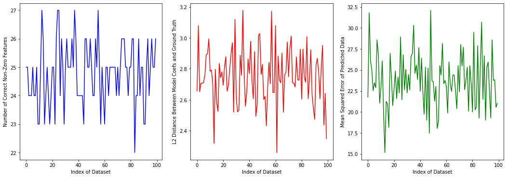
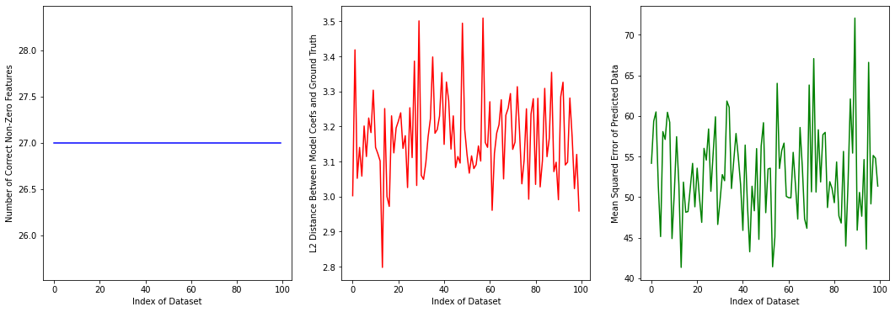
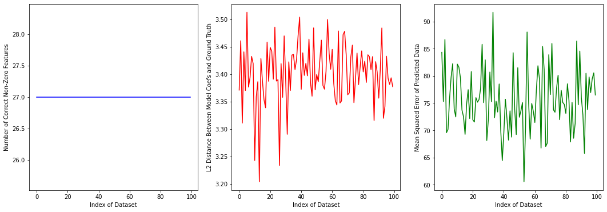

## Project 5: Regularization and Variable Selection with Ridge, Lasso, Elastic Net, Square Root Lasso, and SCAD.

### Part One: Sklearn Compliant SCAD and SQRTLasso
I used the SKLearn compliant functions that we designed in class for both SCAD and SQRTLasso's definitions. These were well functioning classes and work with SKLearn, but the SQRT Lasso in particular is very slow. My Code is below:

	class SQRTLasso:
		def __init__(self, alpha=0.01):
			self.alpha = alpha
		
		def fit(self, x, y):
			alpha=self.alpha
			def f_obj(x,y,beta,alpha):
			n =len(x)
			beta = beta.flatten()
			beta = beta.reshape(-1,1)
			output = np.sqrt(1/n*np.sum((y-x.dot(beta))**2)) + alpha*np.sum(np.abs(beta))
			return output
			
			def f_grad(x,y,beta,alpha):
			n=x.shape[0]
			p=x.shape[1]
			beta = beta.flatten()
			beta = beta.reshape(-1,1)
			output = np.array((-1/np.sqrt(n))*np.transpose(x).dot(y-x.dot(beta))/np.sqrt(np.sum((y-x.dot(beta))**2))+alpha*np.sign(beta)).flatten()
			return output
			
			def objective(beta):
			return(f_obj(x,y,beta,alpha))

			def gradient(beta):
			return(f_grad(x,y,beta,alpha))
			
			beta0 = np.ones((x.shape[1],1))
			output = minimize(objective, beta0, method='L-BFGS-B', jac=gradient,options={'gtol': 1e-8, 'maxiter': 50000,'maxls': 25,'disp': True})
			beta = output.x
			self.coef_ = beta
			
		def predict(self, x):
			return x.dot(self.coef_)
### Part Two: Generating Random Data
I made the data using the given formula and order of ground truth $\beta^*$. I generated 100 datasets, each one normally pulling from a 200 x 1200 Toeplitz matrix where the correlations between features i and j were $c = 0.8^{|i - j|}$. There were only 27 non-zero weights in teh ground truth $\beta^*$. The code I used to generate the data is shown below.

    # The desired mean values of the sample.
    n = 200
    p= 1200
    
    Xdata = []
    ydata = []
    
    beta_star = np.concatenate(([1]*7, [0]*25, [0.25]*5, [0]*50, [0.7]*15, [0]*1098))
    
    mu = [0]*p
    sigma = 3.5
    np.random.seed(123)
    
    v = []
    for i in range(p):
	    v.append(0.8**i) #1D array (vector) of 0.8**i
	r = toeplitz(v)
	for i in range(0,100):
		X = np.random.multivariate_normal(mu, r, size=n)
		y = X.dot(beta_star) + sigma*np.random.normal(loc=0,scale=1,size=n)
		
	Xdata.append(X)
	ydata.append(y)

### Part Three: Evaluation
To evaluate these  models, I graphed the L2 distance, MSE, and correctly identified non-zero weights, for each model over all 100 datasets. Then I also found there averages.

Before doing this however, I used GridSearchCV to tune the major hyperparameters for each type of model. I did this on only one dataset because it took too long to run for all 100 and for each of the models. However, this did provide some major improvements.

I also used a validation funciton to find do KFold validation for each model on all 100 datasets and find the mean squared error on each dataset. Again because of hardware constraints, I had to set $k=2$ for the kfold validation. Normally I would set it higher, but this took much too much time to run.

The code I used to do for grid search, graphing, and validation for Elastic Net is below:

    grid = GridSearchCV(estimator=ElasticNet(fit_intercept=False, max_iter=10000), cv=10, scoring='neg_mean_squared_error',
					    param_grid={'alpha':np.linspace(0,1,50),'l1_ratio':np.linspace(0,1,num=50)})
    gs_results = grid.fit(Xdata[0],ydata[0])
    print(gs_results.best_params_)
    print('The mean square error is for Elastic Net: ', np.abs(gs_results.best_score_))

    # Elastic Net
    non_zeros = []
    L2s = []
    MSEs = []
    for i in range(0,100):
	    model = ElasticNet(alpha=0.1, fit_intercept=False,
						    max_iter=10000)
		model.fit(Xdata[i],ydata[i].reshape(-1,1))
		beta_hat = model.coef_
	
		non_zeros.append(len(np.intersect1d(np.where(beta_star > 0.1), np.where(beta_hat != 0))))
		L2s.append(np.linalg.norm(beta_hat - beta_star, ord=2))
		MSEs.append(validate(model, Xdata[i], ydata[i].reshape(-1,1), 2, 123))
		
		fig, (non_zero, L2, MSE) = plt.subplots(1,3, figsize=(18,6))
		
		non_zero.plot(range(0,100), non_zeros, color='blue')
		non_zero.set(xlabel='Index of Dataset',ylabel = 'Number of Correct Non-Zero Features')
		
		L2.plot(range(0,100), L2s, color = 'red')
		L2.set(xlabel='Index of Dataset',ylabel = 'L2 Distance Between Model Coefs and Ground Truth')
		
		MSE.plot(range(0,100), MSEs, color='green')
		MSE.set(xlabel='Index of Dataset',ylabel = 'Mean Squared Error of Predicted Data')
		
		plt.show()
		print('Mean correct non-zeros ' + str(np.mean(non_zeros)))
		print('Mean L2 ' + str(np.mean(L2s)))
		print('Mean MSE ' + str(np.mean(MSEs)))

In the end, I wasn't able to get meaningful results for all 100 datasets for  SQRTLasso. Unfortunately, this homemade function would not run in time for my hardware to complete.

For the other models however, I got promising results.

 - Elasticnet: 
	 - Mean correct non-zeros 24.79 
	 - Mean L2 2.751559123799759 
	 - Mean MSE 23.742791628966092
- Lasso
	- Mean correct non-zeros 20.39 
	- Mean L2 3.5852023017970707 
	- Mean MSE 23.698891039902524
- Ridge
	- Mean correct non-zeros 27.0 
	- Mean L2 3.167209794939203 
	- Mean MSE 52.92163236150477
- SCAD
	- Mean correct non-zeros 27.0 
	- Mean L2 3.4014219138641537 
	- Mean MSE 75.63356371150178

And the graphs for each are here:

<figure>

<figcaption>Graphs for ElasticNet<figcaption>

</figure>

<figure>

<figcaption>Graphs for Lasso<figcaption>

</figure>

<figure>

<figcaption>Graphs for Ridge<figcaption>

</figure>

<figure>

<figcaption>Graphs for SCAD<figcaption>

</figure>

As we can see, Ridge and SCAD were able to identify all 27 non-zero weights in all datasets, but had higher MSE than the other models. It seems that the lowest L2 model was ElasticNet, at 2.75, while the others were each around 3.5. This seems to indicate that different model types are better at different aspects of the validation.

